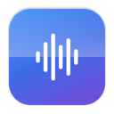
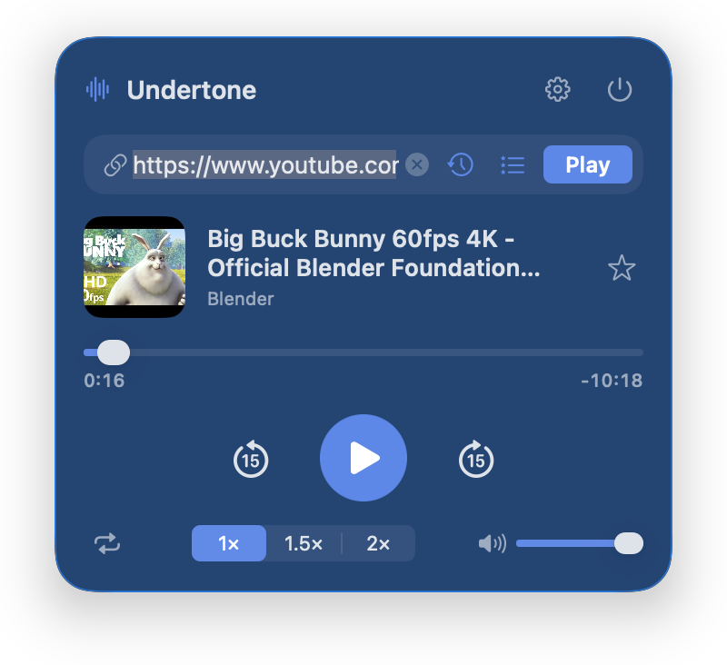

<div align="center">



# Undertone

**Paste a YouTube link into your menu bar and just listen — no browser tab, no video, no ads.**



</div>

Undertone is a tiny macOS menu bar app for listening to YouTube in the background while you work. It plays the
audio-only stream through the native macOS player, so there is no video decoding, no browser, and nothing to
watch. It skips ads by never loading them: it plays the raw audio track directly, the same one AirPods and the
Control Center Now Playing widget see.

Built for macOS 26 (Tahoe) with a real Liquid Glass panel you can tint to any colour.

## Features

- **Paste & play** any YouTube video, playlist, or Music link — or most other sites yt-dlp supports.
- **No ads, no video.** Audio-only; typically ~40 MB of memory while playing.
- **Playback controls:** play/pause, back/forward 15 seconds, a scrubber, **1× / 1.5× / 2×** speed with the
  pitch preserved, **repeat** (off / all / one), and **volume** with a mute toggle.
- **Instant replays.** Resolved streams are cached (they stay valid for hours), so replaying anything from
  Recent starts immediately instead of waiting. The clipboard link is also resolved the moment you open the
  panel, so pressing Play is instant.
- **Playlists:** paste a playlist link and it plays through, with next/previous. The next track is fetched ahead
  of time so changes are quick.
- **Media keys & Now Playing:** the F7–F9 keys, AirPod taps, and the Control Center widget control Undertone
  with no setup.
- **Global shortcuts:** configurable hotkeys for play/pause (`⌃⌥P`), cycle speed (`⌃⌥S`), open the panel
  (`⌃⌥Y`), and next/previous (`⌃⌥→` / `⌃⌥←`).
- **Recent links:** the last ten things you played, one click to replay.
- **Volume from the menu bar:** scroll over the icon to change volume; optionally show the track title next to
  the icon.
- **Liquid Glass, your colour:** pick a tint and glass style; the whole panel is one tinted glass surface.
  **Reset to default** in Settings brings back the blue glass it ships with.
- **Mixes too:** paste a YouTube Mix (`list=RD…`) and its first 50 tracks become the queue. YouTube only
  generates Mixes for some videos, mostly music; when there is none, just that video plays and Undertone says so.
- **Saved links:** press ★ on the track you're hearing (from a Mix or playlist too) and it lands in the ★ list next
  to the URL field, which can also keep a whole playlist or Mix. Hold ⌥ over an entry to remove it.
- **Stays out of the way:** no Dock icon, low memory, and quitting fully stops everything.

## Requirements

- **macOS 26 (Tahoe) or later**, Apple silicon or Intel.
- **[yt-dlp](https://github.com/yt-dlp/yt-dlp) 2026.08.19 or newer** and a JavaScript runtime (**deno**), both
  from Homebrew. yt-dlp is the piece that finds the audio stream; YouTube changes often, so keep it current:

  ```sh
  brew install yt-dlp deno
  ```

  Undertone finds yt-dlp on the usual Homebrew paths automatically and tells you in the panel if it is missing
  or out of date. You can also point it at a specific binary in Settings.

Building needs only the **Command Line Tools** (`xcode-select --install`) — no full Xcode.

## Install

```sh
git clone https://github.com/JoaoCVerissimo/undertone.git
cd undertone
make install      # builds a release .app and copies it to /Applications, then launches it
```

Other targets:

| Command | What it does |
|---|---|
| `make build` | Build `build/Undertone.app` (ad-hoc signed) without installing. |
| `make run` | Build and launch from `build/`. |
| `make dev` | Build and run in the foreground with logs in the terminal. |
| `make test` | Run the unit tests. |
| `make doctor` | Read-only check of yt-dlp, deno, and the build. Changes nothing. |
| `make icon` | Regenerate the app icon. |
| `make uninstall` | Quit and remove `/Applications/Undertone.app`. |

To launch it at login, install to `/Applications` (as `make install` does) and turn on **Launch at login** in
Settings.

## Using it

Click the menu bar icon to open the panel. Paste a link and press **Play** (if your clipboard already holds a
YouTube link, the field is pre-filled). Right-click the icon for a quick play/pause and Quit menu.

The panel closes when you click away or press Escape. `⌘V` pastes into the field even though Undertone never
steals focus from whatever you are working in.

### URL scheme

Undertone registers `undertone://` so you can drive it from scripts, Shortcuts, or Alfred/Raycast:

```
undertone://play?url=<youtube-url>   undertone://play      undertone://pause
undertone://toggle                   undertone://next      undertone://previous
undertone://speed?value=2            undertone://seek?to=90
undertone://volume?value=0.5         undertone://mute      undertone://repeat?mode=one
undertone://open                     undertone://settings  undertone://close  undertone://quit
undertone://save                     (toggle the playing track in saved links)
```

Percent-encode the `url` value (`&` becomes `%26`), or the link's own parameters are read as Undertone's.

## How it works

1. You paste a link. Undertone classifies it (video / playlist / mix / other site).
2. It runs `yt-dlp -j` to get the best audio-only stream (AAC in an MP4 container, which the native player can
   play), preferring the fast `visionos` client and falling back to yt-dlp's default clients.
3. It plays that stream URL directly with `AVPlayer` — audio only, no video layer, no download.
4. It publishes the track to macOS so media keys, AirPods, and Control Center work, and it keeps the panel,
   scrubber, and speed in sync.

Nothing is downloaded to disk and no video is ever decoded. yt-dlp's reported duration is used for the progress
bar because YouTube's audio streams report a misleading length to the player. Resolved stream URLs are cached
until their expiry so replays skip yt-dlp entirely.

### Performance

Measured on an M1 MacBook Air with `top` and `footprint`, so you can hold it to this:

| State | CPU (one core) | Idle wake-ups | Memory |
|---|---|---|---|
| Idle, nothing loaded | 0% | 0 | ~18 MB |
| Playing, panel closed | ~1% | 0 | ~32 MB |
| Playing, panel open | ~2% | 0 | ~36 MB |
| Playing at 2× | ~4% | ~0 | ~36 MB |
| Paused for 10+ minutes | 0% | ~0 | ~33 MB |

How it stays that way:

- **No timers when you're not looking.** The progress clock runs only while the panel is open. With the
  panel closed nothing ticks and nothing re-renders; the app just plays audio.
- **Deep idle.** After 10 minutes paused it releases the media pipeline entirely (no buffering, no wake-ups).
  Pressing Play rebuilds it from the stream cache, instantly. Tune with
  `defaults write com.jverissimo.undertone idleUnloadSeconds -float 300`.
- **Nothing spawned at launch.** yt-dlp is located and version-checked once, then that result is reused for
  24 hours (validated cheaply), so launching, including at login, starts no processes. Recheck forces a probe.
- **One yt-dlp at a time.** The background look-ahead (next playlist entry, the link on your clipboard)
  never runs alongside a resolve you asked for, a link that just failed isn't retried for 10 minutes, and
  automatic recoveries are capped at two per track. yt-dlp itself is the only real CPU cost, about 3–5
  seconds of one core per new link, and only when something has to be resolved.
- **Bounded memory.** Streams and artwork are cached with fixed limits; memory plateaus after a few tracks
  rather than growing.

### Why it needs yt-dlp

YouTube does not offer a stable public audio URL, and it changes how streams are served often. yt-dlp is the
widely-maintained tool that keeps up with those changes. Undertone leans on it entirely and never hard-codes
anything about YouTube, so when something breaks the fix is almost always:

```sh
brew upgrade yt-dlp
```

The panel says so when it detects a failure that looks version-related (a 403, "requested format is not
available", "the page needs to be reloaded", and similar).

## Project layout

```
Sources/UndertoneCore/   Pure Swift: link parsing, yt-dlp models & client, playlist queue, formatting. Unit-tested.
Sources/Undertone/       The app: AppKit shell (status item + glass panel), AVPlayer engine, SwiftUI views, settings.
Sources/UndertoneSelfTest/  The test suite as a runnable executable (see "Testing" below).
Vendor/KeyboardShortcuts/   Vendored, lightly patched dependency (see Vendor/README.md).
scripts/bundle.sh        Assembles and ad-hoc-signs the .app from `swift build` output — no Xcode needed.
scripts/make-icon.swift  Renders the app icon.
```

### Testing

Tests live in `Sources/UndertoneSelfTest` and use [Swift Testing](https://developer.apple.com/documentation/testing).
They run as a small executable rather than through `swift test`, because `swift test` does not execute Swift
Testing suites when only the Command Line Tools are installed. `make test` runs them; pass-through flags work,
e.g. `swift run UndertoneSelfTest --filter LinkParser`.

## Troubleshooting

- **"yt-dlp isn't installed" / playback fails immediately.** Run `brew install yt-dlp deno`, then Recheck in the
  panel. Run `make doctor` to see what Undertone sees.
- **A 403, or "requested format is not available".** yt-dlp is behind YouTube. `brew upgrade yt-dlp`.
- **A specific video won't play** but others do. It may be private, age-restricted, members-only, or region-
  blocked. Undertone will say which.
- **A Mix plays only one video.** YouTube generates Mixes only for some videos (mostly music). Without one,
  Undertone says so and plays the video.
- **Launch at login is greyed out.** Run the built app (`make install`), not a bare `swift run` build.

## Notes

This is a personal-use tool. Respect YouTube's Terms of Service and creators' rights; don't use it to redistribute
content. It streams for listening only and downloads nothing.

## License

MIT © 2026 João Veríssimo. Bundles [KeyboardShortcuts](https://github.com/sindresorhus/KeyboardShortcuts) by
Sindre Sorhus (MIT).
